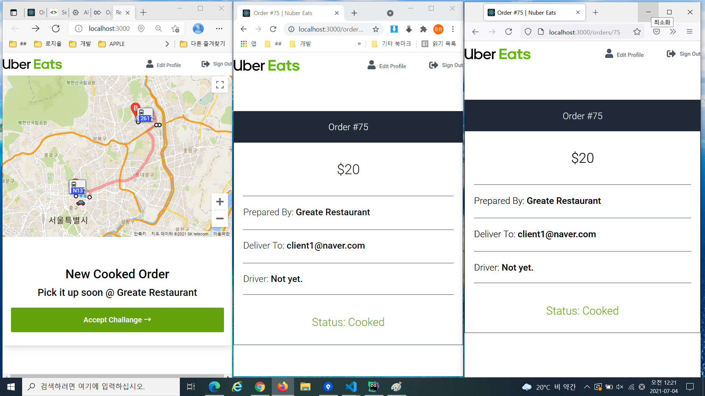
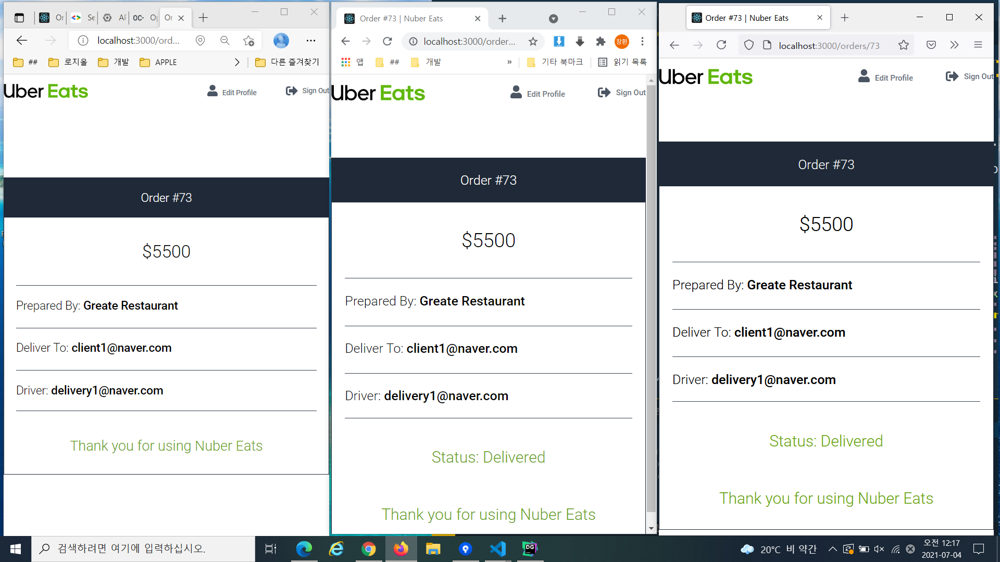
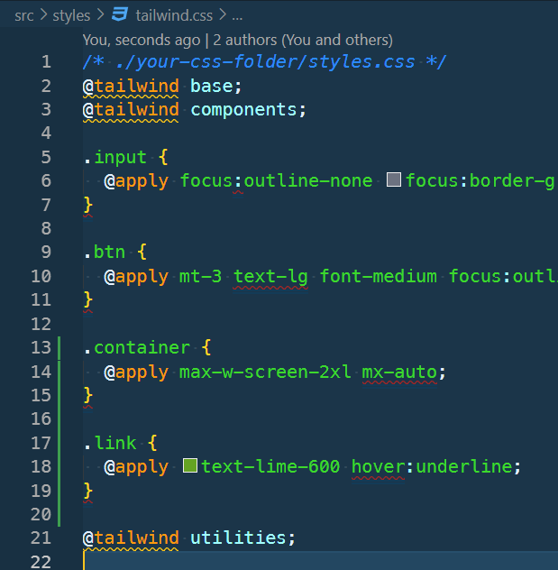

# Nuber Eats Frontend project

## 스택

- Typescript
- React.js
- Graphql
- Tailwindcss
- Jest
- @testing-library/react
- victory chart
- paddle solution for payments

## 화면





## 개발 이슈

- [개발이슈 링크](./readme-ref/md/DevIssue.md)

## 셋업 및 프로젝트 create

- create

  - npx create-react-app ./ --template=typescript

- module setup & install

  - tailwind
    - yarn add tailwindcss postcss autoprefixer
    - npx tailwindcss init
      - tailwind.config.js 자동 생성
      - config 내용

      ```js
      module.exports = {
        purge: [],
        darkMode: false, // or 'media' or 'class'
        theme: {
          extend: {}
        },
        variants: {
          extend: {}
        },
        plugins: []
      };
      ```

  - router
    - yarn add react-router-dom

  - react-hook-form
    - yarn add react-hook-form

  - apollo/graphql
    - yarn add @apollo/client graphql
    - yarn add subscriptions-transport-ws
    - yarn global add apollo && yarn add apollo

  - font awesome(react-fontawesome)
    - yarn add @fortawesome/fontawesome-svg-core
    - yarn add @fortawesome/free-solid-svg-icons
    - yarn add @fortawesome/react-fontawesome

  - victory
    - yarn add victory

  - google map
    - yarn add google-map-react
    - yarn add -D @types/google-map-react
    - yarn add -D @types/google.maps

- vs-code extends

  - Tailwind CSS IntelliSense (Brad Cornes) 설치
  - Apollo GraphQL 설치

- eslint 메시지가 터미널에 나타나지 않게 package.json 스크립트 설정

  - cross-env DISABLE_ESLINT_PLUGIN=true react-scripts start

- config 파일 생성 및 setup

  - postcss.config.js 생성

  ```js
  // postcss.config.js
  module.exports = {
    plugins: {
      tailwindcss: {},
      autoprefixer: {}
    }
  };
  ```

## Tailwindcss

- 참고 URL
  <https://tailwindcss.com>
  <https://tailwindcss.com/docs>

  - install 참고
    <https://tailwindcss.com/docs/installation>

- node.js 버전 12이상에서 작동을 제대로 함

- tailwind 설치후 @apply 유틸 사용을 위해 /src/styles/tailwind.css 에 아래와 같이 css 적용을 하는데 아래 그림과 같이 계속 빨간색으로 warning 가 뜬다.

  
  
  - 해결방법
    - stylelint 관련 설치
      - yarn add -D stylelint stylelint-config-standard
    - root 디렉토리에 stylelint.config.js 파일 생성 후 아래 입력

      ```js
      module.exports = {
        extends: ['stylelint-config-standard'],
        rules: {
          'at-rule-no-unknown': [
            true,
            {
              ignoreAtRules: [
                'tailwind',
                'apply',
                'variants',
                'responsive',
                'screen',
              ],
            },
          ],
          'declaration-block-trailing-semicolon': null,
          'no-descending-specificity': null,
        },
      }
      ```

    - .vscode > settings.json 에 아래 설정 추가

      ```json
      "css.validate": false,
      "less.validate": false,
      "scss.validate": false,
      ```

## PostCSS

- [PostCSS 설명 링크](./readme-ref/md/PostCSS.md)

## Graphql

- Localonly Only Fields

  - 로컬 상태관리를 위한 환경 제공
  - <https://www.apollographql.com/docs/react/local-state/managing-state-with-field-policies/#gatsby-focus-wrapper>
  - query 방식 / reactive variable 방식으로 사용할 수 있다.
  - reactive variable 방식이 훨씬 간단하다.

  - apollo client 세팅

  ```javascript
  import { ApolloClient, InMemoryCache, makeVar } from '@apollo/client';

  export const isLoggedInVar = makeVar(false);

  export const client = new ApolloClient({
    uri: 'http://localhost:4000/graphql',
    cache: new InMemoryCache({
      typePolicies: {
        Query: {
          fields: {
            isLoggedIn: {
              read() {
                return isLoggedInVar();
              }
            }
          }
        }
      }
    })
  });
  ```

  - query 방식

    ```javascript
    import { useQuery } from '@apollo/client';
    import gql from 'graphql-tag';

    const IS_LOGGED_IN = gql`
      query isLoggedIn {
        isLoggedIn @client
      }
    `;

    function App() {
      const {
        data: { isLoggedIn }
      } = useQuery(IS_LOGGED_IN);

      return isLoggedIn ? <LoggedInRouter /> : <LoggedOutRouter />;
    }
    ```

  - reactive variable 방식

  ```javascript
  // App component
  import { useReactiveVar } from '@apollo/client';
  import { isLoggedInVar } from './apollo';

  function App() {
    const isLoggedIn = useReactiveVar(isLoggedInVar);

    return isLoggedIn ? <LoggedInRouter /> : <LoggedOutRouter />;
  }

  // LoggedOutRouter component
  import { isLoggedInVar } from '../apollo';

  export const LoggedOutRouter = () => {
    const handleClick = () => {
      isLoggedInVar(true);
    };

    return (
      <div>
        <h1>Logged Out</h1>
        <button onClick={handleClick}>Click to login</button>
      </div>
    );
  };
  ```

- code gen
  - code generate 를 하기위해 아래 모듈을 설치

  ```bash
    yarn add apollo
  ```

  - apollo.config.js 를 생성 후 세팅 내용 기재

  ```javascript
  module.exports = {
    client: {
      // tsx 가 확장자인 파일에서 query 를 검색
      includes: ['./src/**/*.tsx'],
      // tag 명
      tagName: 'gql',
      // graphql backend setting
      service: {
        name: 'nuber-eats-backend',
        url: 'http://localhost:4000/graphql',
      },
    },
  };
  ```

  - code gen 명령 실행
    - apollo client:codegen mytypes.d.ts --target=typescript

- vs-code 확장툴을 사용한 gqlphql 작성시 인텔리센스 도움받기
  - vs-code extension tool 명
    - Apollo GraphQL
  - graphql 작성시 인텔리센스 도움을 받을 수 있다.
  - 참고: <https://www.apollographql.com/docs/devtools/editor-plugins/>
  - 확장툴이 제대로 동작되기 위해서는 apollo.config.js 의 설정파일이 필수
  - 설정파일 작성이 끝났다면 vs-code 제일 하단에 "Apollo🚀" 을 클릭하여 제대로 스키마를 받아서 작동하는지 확인할 것

- Subscription
  - 참고 Url
    <https://www.apollographql.com/docs/react/data/subscriptions/#setting-up-the-transport>

## React-hook-form

- <https://react-hook-form.com/get-started>
- <https://react-hook-form.com/kr/get-started/>

## Module Declare

- 설치한 모듈이 @types 를 지원하지 않을 경우 아래와 같은 방법으로 해결할 수 있다.
- 1번째 방법 > 아래 처럼 `declare module '모듈명'`을 입력해 타입 에러가 나지 않게 할 수 있다.

  - react-app-env.d.ts

  ```js
  /// <reference types="react-scripts" />

  declare module 'react-router-dom';
  ```

- 2번째 방법 > 특정 모듈에 대해 타입 정의가 없을 경우 아래 github 주소의 DefinitelyTyped 으로 가보면 많은 라이브러리에 대한 type 정의를 해놓은것이 있다.

  - Definitely Types GitHub 주소
    <https://github.com/DefinitelyTyped/DefinitelyTyped>

  - 타입정의된 파일을 가져와서 프로젝트폴더의 "/types/모듈명/index.d.ts" 에 해당 모듈의 타입파일을 복사해 넣고,
  - tsconfig.json 의 "typeRoot" 속성 값에 아래와 같이 해당 타입 경로를 설정해 준다.

    ```json
    {
      "compilerOptions": {
        ...
        "typeRoots": ["node_modules/@types", "src/types"]
      },
    }
    ```

  - 커스텀 타입 정의 파일들이 있는 폴더에서 해당 모듈의 폴더를 생성한다.

    - src/types/bcrypt/index.d.ts

  - 타입정의 내용을 복붙하여 넣고 아래와 같이 `declare module "모듈명"`으로 감싸 준다.

    ```js
    declare module 'bcrypt' {
      export declare function genSaltSync(rounds?: number, minor?: string): string;
      ...
    }
    ```

## Testing

- Graphql Test 방법
  - 첫번째 방법, MockProvider 를 쓰는 방법
    - 참고 링크
      <https://www.apollographql.com/docs/react/development-testing/testing/>
      <https://www.apollographql.com/docs/react/api/react/testing/#mockedprovider>
    - 사용 예시

      ```javascript
      it('renders ok', async () => {
        await waitFor(async () => {
          const { queryByText } = render(
            <MockedProvider
              mocks={[
                {
                  request: {
                    query: ME_QUERY,
                  },
                  result: {
                    data: {
                      me: {
                        id: 1,
                        email: '',
                        role: '',
                        verified: true,
                      },
                    },
                  },
                },
              ]}
            >
              <Router>
                <Header />
              </Router>
            </MockedProvider>,
          );

          await new Promise((resolve) => setTimeout(resolve, 0));
          expect(queryByText('Prease verify your email.')).toBeNull();
        });
      });
      ```

  - 두번째 방법, mock-apollo-client 를 쓰는 방법
    - MockProvider 를 쓸 경우 쿼리가 몇번 호출하였는지, 어떤 argument 로 호출하였는지도 테스트 하고 싶은데 그렇게 할 수가 없다. mock-apollo-client 를 사용하면 좀 더 디테일 하게 테스트가 가능하다.
    - 참고 링크: <https://github.com/mike-gibson/mock-apollo-client>

- 모듈 mock
  - 아래 ReferenceError 시 변수에 `'mock' prefix` 를 붙여주어야 에러가 나지 않는다.
    - 에러 메시지
      - 'jest.mock()' is not allowed to reference any out-of-scope variables.
      - Invalid variable access: pushMockImplementation
      - Variable names prefixed with 'mock' (case insensitive) are permitted
  - react-router-dom 예시 코드
    - 모든 모듈에 대에서 mock을 하지 않기 위해 jest.requireActual 를 사용하여 필요한 부분만 mock 를 하게 함

    ```javascript
    // ReferenceError 대응
    // prefix 로 mock를 붙여주어야 에러가 나지 않는다.
    const mockPush = jest.fn();

    jest.mock('react-router-dom', () => {
      const realModule = jest.requireActual('react-router-dom');

      return {
        ...realModule,
        useHistory: () => ({
          push: mockPush,
        }),
      };
    });

    describe('<CreateAccount />', () => {
      it('module library mock test ', async () => {
        // history push 체크
        expect(mockPush).toHaveBeenCalledWith('/');
      });

      // 모든 테스트가 끝난뒤 모든 mock 를 clear 처리
      afterAll(() => {
        jest.clearAllMocks();
      });
    });
    ```

- cypress
  - 설치 및 세팅
    - 그냥 yarn add -D cypress 를 하여 설치하면 cypress open을 했을 시에 `Cypress fail to start`라고 나올 수 있다.
    - `npx cypress install --force` 도 실행하여 cypress 환경을 만들고 실행 할 것
    - cypress > tsconfig.json 설정

      ```json
      {
        "compilerOptions": {
          "allowJs": true,
          "baseUrl": "../node_modules",
          "types": ["cypress"],
          "outDir": "#"
        },
        "include": ["./**/*.*"]
      }
      ```

  - 커스텀 command
    - 아래 파일에 커스텀 커맨드 작성
    - 인텔리센스 제공을 위해 global namespace 를 사용하여 타입 작성
    - cypress/support/commands.ts

    ```javascript
      // type 제공
      declare global {
        namespace Cypress {
          interface Chainable {
            // 아래 커스텀 함수에 대한 타입 작서
            assertLoggedIn(): Chainable<string>;
          }
        }
      }

      // 커스텀 함수 작성
      Cypress.Commands.add('assertLoggedIn', () => {
        cy.window().its('localStorage.nuber-token').should('be.a', 'string');
      });
    ```

  - fixtures 사용
    - api 호출시에 request 또는 response json 값을 인터셉트 할 경우 fixtures 에서 정의한 json 값을 재사용해서 주입시킬 수 있다.

    - cypress > fixtures > auth > xxxx.json 파일 생성

      ```json
      {
        "data": {
          "createAccount": {
            "ok": true,
            "error": "",
            "__typename": "CreateAccountOutput"
          }
        }
      }
      ```

    - 아래와 같이 인터셉트 하는 곳에 fixture 를 주입

    ```javascript
    // graphql call 인터셉트
    user.intercept('http://localhost:4000/graphql', (req) => {
      const { operationName } = req.body;

      if (operationName && operationName === 'createAccountMutation') {
        req.reply((res) => {
          res.send({
            /** 
            data: {
              createAccount: {
                ok: true,
                error: null,
                __typename: 'CreateAccountOutput',
              },
            },
            */

            // fixture 방식
            fixture: 'auth/create-account.json',
          });
        });
      }
    });
    ```

## Victory Chart

- Doc Url
  <https://formidable.com/open-source/victory>

## Paddle for Payments

- Url
  <https://paddle.com>

## Google map

- google maps dev doc
  - <https://developers.google.com/maps/documentation/directions/cloud-setup?hl=en>

- 아래 링크로 접속 후 > API 및 서비스 > 라이브러리 로 이동
  - <https://console.cloud.google.com> 
  - Maps JavaScript API  사용 클릭
  - Directions API 사용 클릭
  - Geocoding API 사용 클릭

- API 키 생성 및 발급
  - Google Maps Platform > 사용자 인증 정보 > 페이지 상단에서 '사용자 인증 정보 만들기' 클릭 > 'API키' 클릭 하여 API 발급받기

- 주의
  - 만약 react 화면에서 "google 지도를 제대로 로드할 수 없습니다." 라고 나온다면, 구글 결제페이지에서 결제 카드가 등록되어 있지 않아서다. 결제 키드 등록 후 결제 계정 생성 및 연결을 하고 나면 위의 warning alert 가 뜨지 않는다.

  - Directions API 의 travelMode가 대한민국에서는 TRANSIT 모드만 지원한다.

- 타입스크립트
  - <https://developers.google.com/maps/documentation/javascript/using-typescript?hl=ko>

  - tsconfig.json 설정

    ```json
    {
      "compilerOptions": {
        "types": ["google.maps"]
      }
    }
    ```

  - .eslintrc 설정

    ```json
    "globals": {
      ...
      "google": "readonly"
    },
    ```
